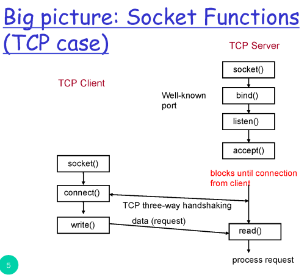
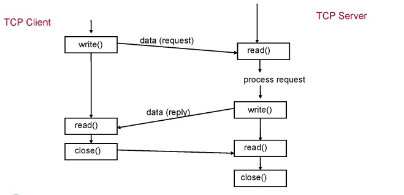
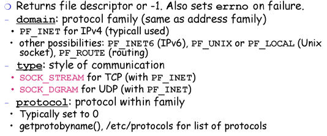
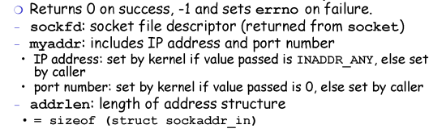
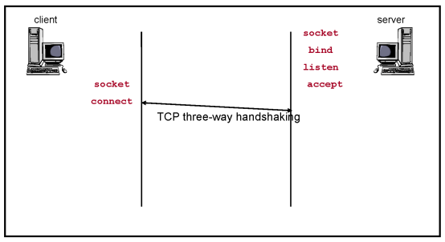
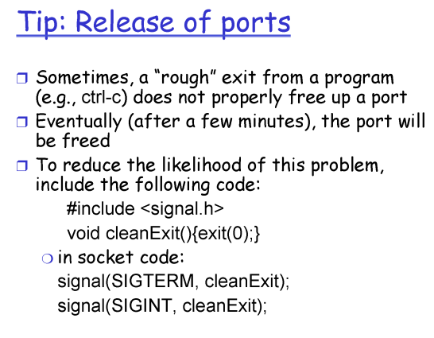
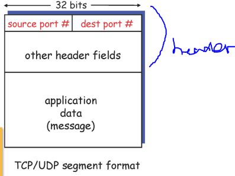
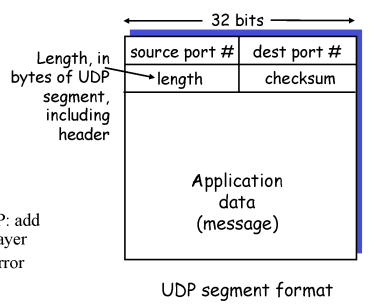
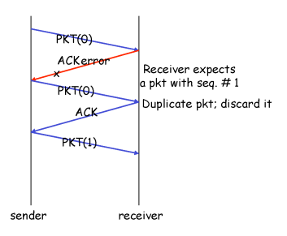

# 애플리케이션계층 1,2

 

# Socket Programming

 

## Socket

- An interface between application and network
- Once configured, the application can

 

## Two essential types of sockets

- TCP
- UDP

 

# Big picture : Socket Functions (TCP case)

TCP socket 사이에 연결이 이루어진 후에 read, write의 연속적인 과정이 이루어짐

HTTP request를 받아서 read(), wrtie()후에 response

 

## Socket Creation and Setup

- Create
- Bind
- Accept

 

### Create Function

`int socket(int domain, int type, int protocol);`

어떤 타입으로 연결을 진행하지는, 두번째 parameter가 중요함

 

### Bind Function

`int bind (inr sockfd, struct sockaddr*myaddr, int addrlen);`

 client는 port넘버가 상관 없으므로 bind 과정이 굳이 필요없음

+ UDP는 그냥 생성 후 바로 전송.

 

# Transport-layer

 

## Multiplexing/Demultiplexing

multiplexing : Sender측에서 data에 대한 정보를 압축하는 과정

demultiplexing : Reciever측에서 data에 대한 정보를 풀어내는 과정

segment는 data, header로 구성.

header에 적힌 source port, dest port, 등을 사용해서 demultiplexing함

 

UDP통신에서는 source port 와 dest port를 사용해서 어떤 socket을 demultiplexing할지 정함

TCP에서는 source IP, source port, dest IP, dest port를 사용

→ 같은 pocket값을 가지고 있어도 다른 socket을 사용하는 이유: IP값이 달라서

UDP는 header에 단 4가지 정보만 존재

UDP가 아무것도 안하는 것처럼 보이지만 Mux, Demux, Error check는 함

Transport 계층 에서 Error가 발견되면 Application 계층으로 값을 보내지 않음

Transport Layer 에서는 Mux/Demux, Errorcheck가 꼭 진행돼야 함

 

## RDT protocol

**Realiable Data Transfer Protocol**

packet이 유실되었거나 손상되었을 때를 해결하면 reliable한 통신을 진행할 수 있음 - RDT protocol

 

### Channel with packet errors (no loss)

- 올바른 정보를 받았는 지에 대한 수신자의 피드백이 필요함.
- Acknowledgements (ACKs) : 긍정적인 피드백
- Negative acknowledgements (NACKs) : 부정적인 피드백
- 수신자는 ACK을 받으면 다음 동작 수행, NACK을 받으면 재전송

 

ACK / NACK신호에서 Error가 발생하면, 어떤 정보인지 모르니 NACK이라고 가정하고 재전송

Sender가 정보를 재전송 했을 때, Receiver는 이게 재전송된 패킷인지 새로운 패킷인지 구분할 수 없음. 그래서 Sneder는 data를 전송할 때, Sequence Number를 붙여서 전송함

Packet Error를 위한 해결 방법

- Error detection
- Feedback
- Retransmission
- Sequence #

 

### Channel with loss & packet errors

Timer를 사용함

정해둔 Time동안 피드백 (ACK, NACK) 이 오지 않으면 packet이 loss된 걸로 판단해서 재전송함

 

Packet loss를 위한 해결 방법

- Timer를 사용한 Timeout

 

이러한 정보들은 모두 TCP header안에 들어있음!

 

---

 

그림 출처 

KOCW, 컴퓨터네트워크, 한양대학교, 이석복 교수님

3, 4차시 강의

[http://www.kocw.net/home/cview.do?cid=6166c077e545b736](http://www.kocw.net/home/cview.do?cid=6166c077e545b736) 

 
