# 전송계층 3

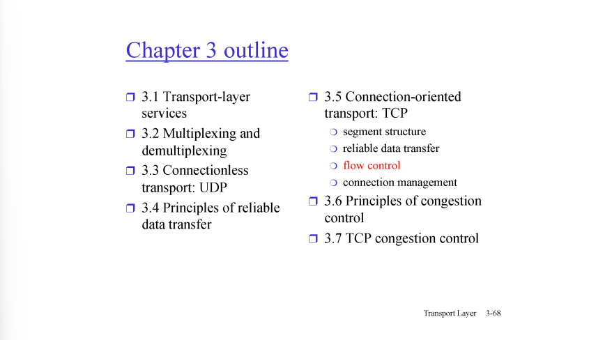

flow control

receive buffer : 순서에 맞지 않게 오는 데이터들 쌓아놓음

sender가 보낼 때는 receive buffer에 남은 공간 만큼 보내는 것만 의미 있음

receive buffer가 받을 수 있는 능력 만큼 보내는 것 - flow control

tcp segment의 header부분의 receive buffer size라는 필드로 리시브 버퍼의 빈 공간 정보 담아 보냄

그래서 flow control은 receiver가 drive함

Q : flow control이 보내는 양 조절? or 보내는 속도 조절?

보내는 양 많으면 보내는 속도도 빠른 거니깐 결국 둘 다 조절 하는 거임!

극단적 예시 : recv buf  빈 공간 없을 때 sender가 가만히 기다리게 됨

sender는 주기적으로 data를 보내 줌 -> 그래야 recv buf가 segment에 공간 정보를 담아 보내주므로

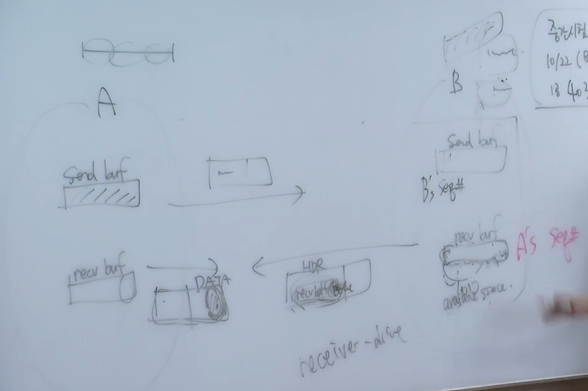

connection management

---

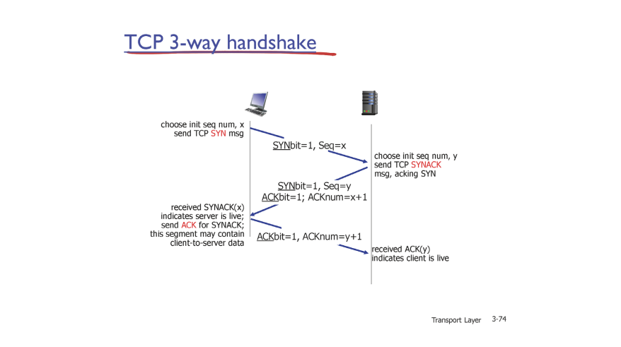

client

tcp tegement header에 syn을 넣어 보냄, 첫 sequence number 보냄

(tcp connection을 하고자 하는 의사표현)

server

synack와 자신의 sequence number와 clinet가 보냄 sequecne number + 1 해서 보냄

client

이때부턴 syn field 0, ack 보냄, 데이터가 포함될 수 있음

왜 두번만에 안끝내고 3way로 함?

두 번이면 처음 메세지를 발생시킨 사람은 통신에 대한 확답이 있지만 server 입장에선 확답을 받을 수 없음

---

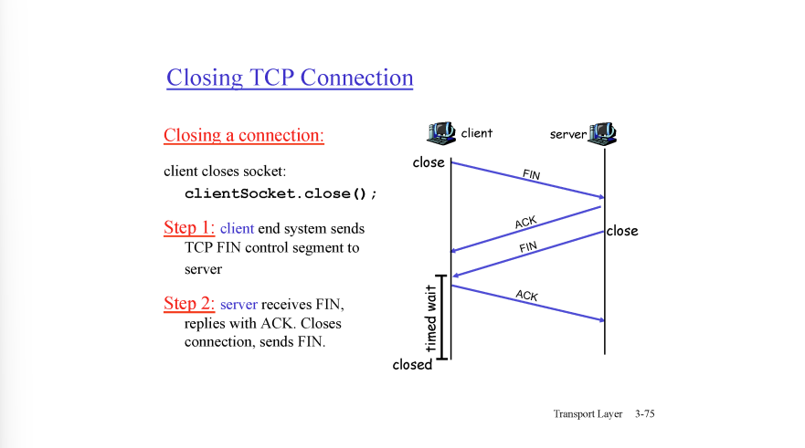

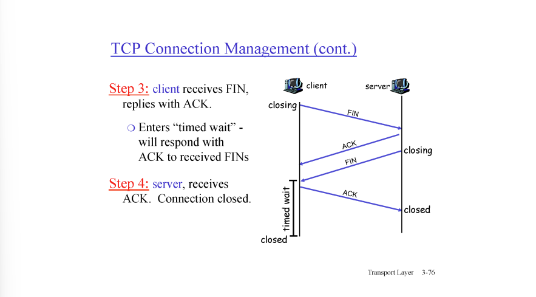

왜 timed wait?

만약 client가 보낸 ack가 유실됐다면 server가 못 끝냄

따라서 ack가 확실히 server에 도달할 때 까지 어느 정도 기다려야 됨

(timeout value는 항상 변함 그래서 그냥 적당히 기다림)

---

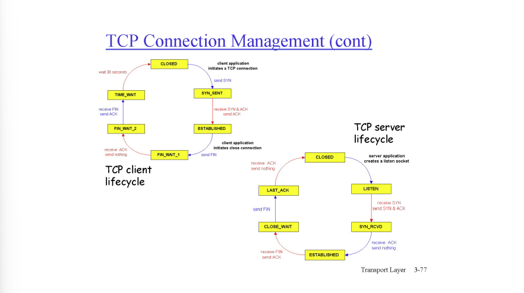

---

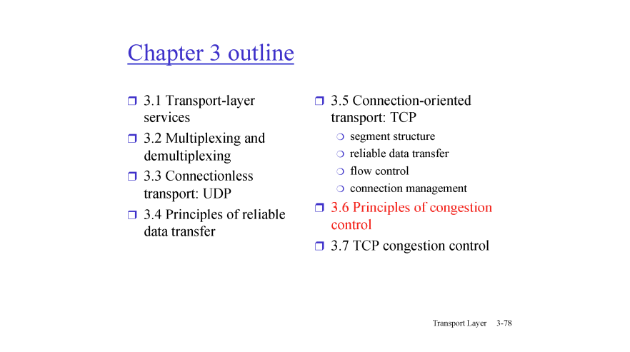

tcp는 네트워크가 막혀서 데이터 못가면 재전송하기 때문에 네트워크 상황을 더 악화시킬 수 있음

그래서 네트워크가 막히면 전송 양을 줄여야 함 ( 자기 자신을 위해서)

tcp는 네트웤이 막히게 둬선 안되기 때문에 자기자신의 보내는 양을 줄이고 네트웤 상황이 좋으면 보내는 양 늘림

---

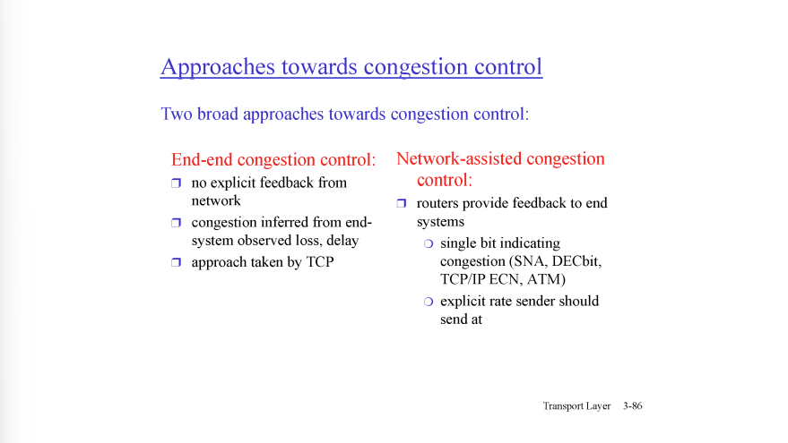

네트웤 상황이 좋아지고 안좋아지는걸 어떻게 알거임?

network-assisted congestion control -> router들이 tcp에 알려줌

현재 네트웤은 이렇게 안하긴 함 -> 현재는 end-end congestion control을 함

각자가 알아서 네트워크 상황을 유추해서 데이터 양 조절함

어떻게? tcp segment 왔다 갔다 하는 걸로 유추(유일한 단서)

data 보냈는데 ack 안오면? 뭔가 문제 생겼을 거니깐 네트워크 상황 유추!

아주 정확하지는 않음

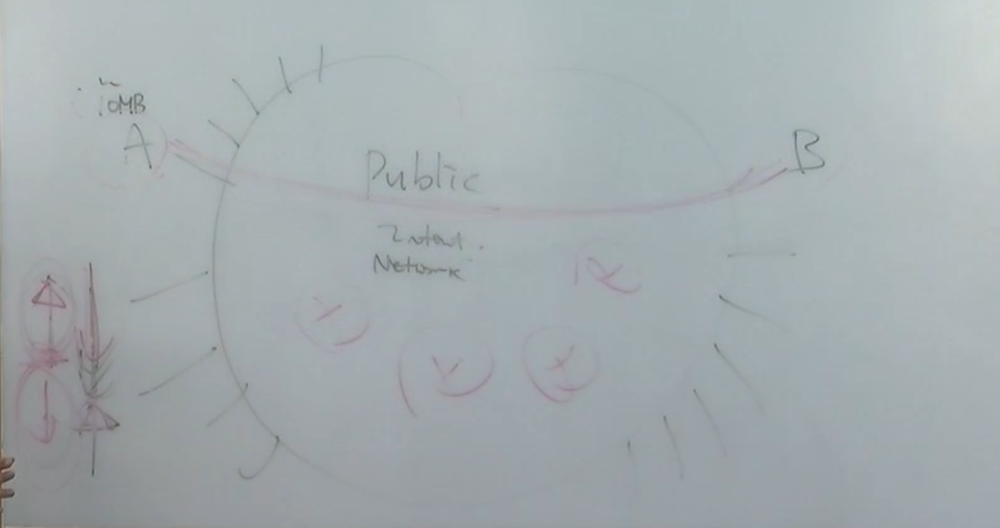

# 전송계층 4

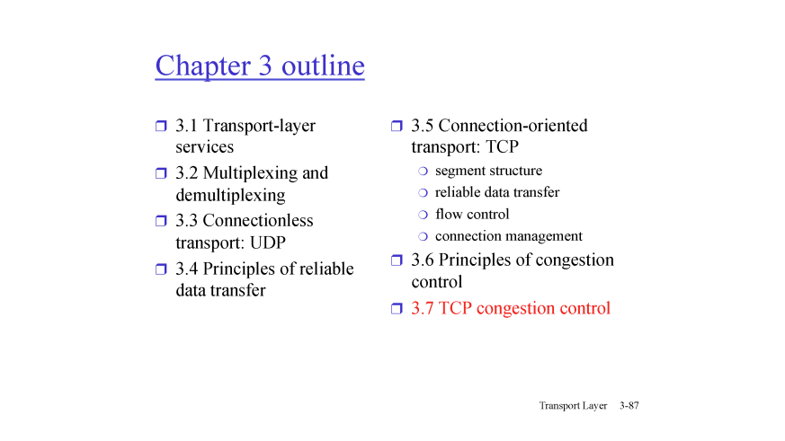

---

파이프 굵기를 알 수 없음, 파이프마다 연결고리도 다름

파이프 굴기보다 더 많이 보내면 파이프 터짐, 데이터 안감!

물을 부을 때 각기 다른 굴기 파이프 따라 경로 형성 될 때 

가장 critical한 부분은 가장 얇은 파이프 부분임

병목현상 가능성 큰 곳!

이 포인트를 어떻게 찾음? 아무도 report를 안해주는데? 네트워크로 부터는 report 못받음

양 끝단끼리 report하며 유추해야함

조금씩 늘려서 붓다가 네트워크 한계가 도달하면 그거 맞춰서 함

---

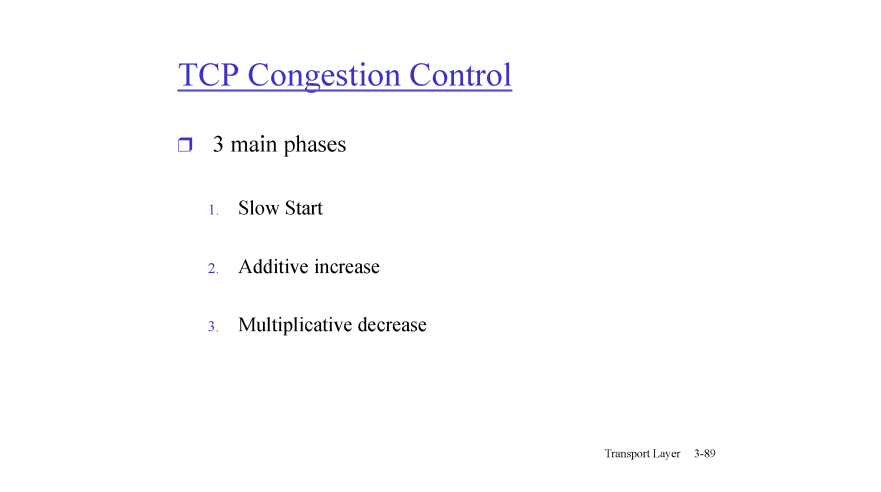

slow start : 네트워크 상황을 모르니 처음 시작할 때 조금씩 부으면서 파악함

겸손하게 시작하지만 지수적으로 증가하기 때문에 사실 slow하진 않음

threshold에 도달하면 이제 조심 해야함 이 이후로는 linear하게 증가시킴

왜 늘릴때는 서서히 늘리고 줄일때는 확 줄이나?

풀때는 확 풀어야 풀림

---

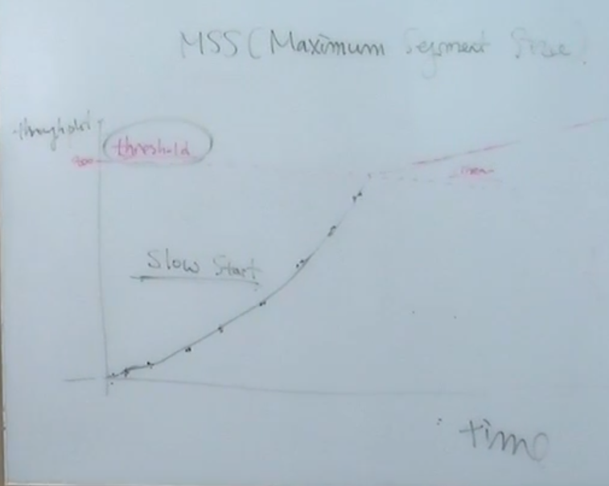

처음에 MSS 1(window size 1)이었다가 ack 잘오면 두배씩 늘어남

maximum segment size

---

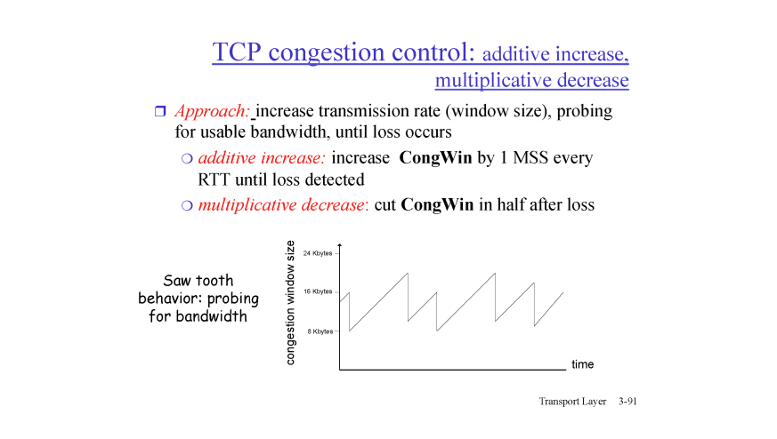

window size 증가시키다가 muliplicative decrease

---

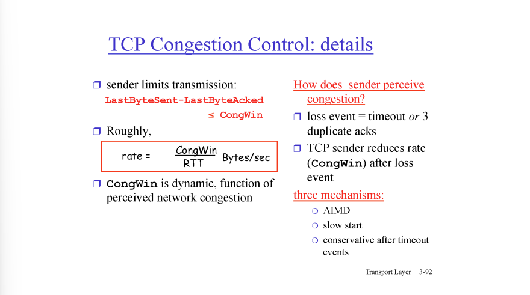

전송속도 = congestion size / RTT

실제로 변동이 심한건 congestion size

따라서 전송 속도는 congestion size에 의해 주로 결정됨

congestion size 결정 되는건 network임 따라서 network이 우리의 전송 속도를 결정함

network 붐비면 congwin 작아지고 network 한산하면 congwin 커짐

따라서 우리 모두의 행동이 각기 다른 전송속도에 영향을 주는 거임

서로 간에 영향을 미치고 있음

---

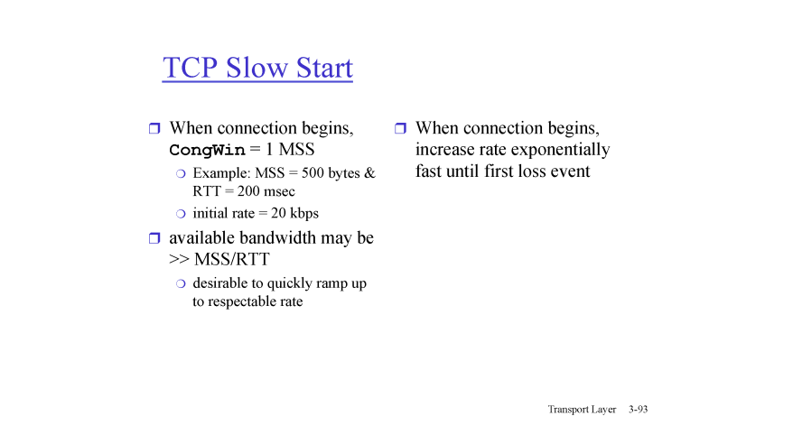

---

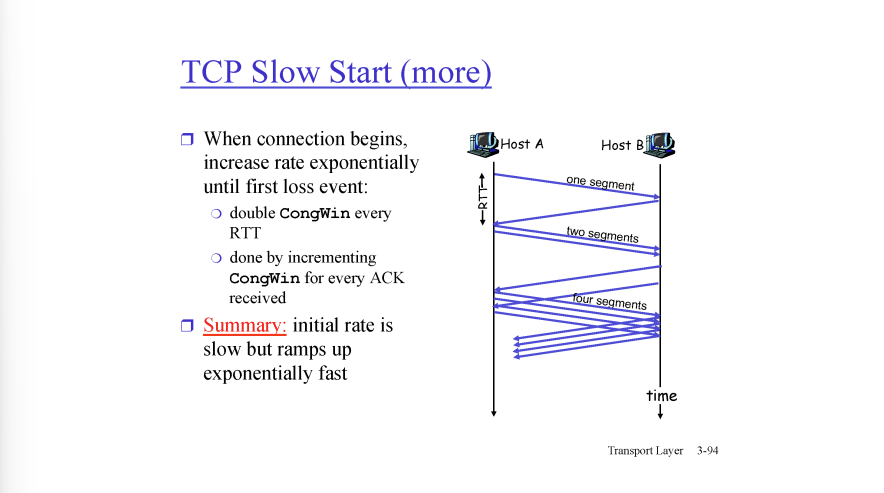

exponential하게 증가해서 실제로는 진짜 빨리 늘어남

---

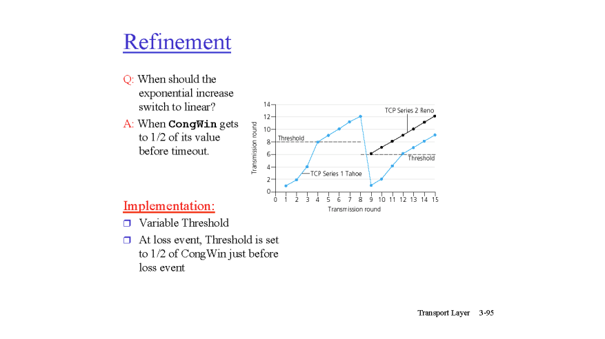

오타 : y축 conjestion window size임

첫번째 버전 TCP Tahoe

8에서 packet 유실 탐지되면 threshold 값을 지금 window사이즈의 절반으로 바꿈

난 다시 slow start 시작

그러다가 다시 Threshold 넘으면 linear

타호, 레노

새로운 버전 TCP Reno

timer 통해 packet 유실 탐지

1. timeout
2. 3 dup ACK

=> 두 경우의 네트워크 상황

1. packet도 안갔고 이후 packet도 다 안 간 거임
2. 특정 packet만 안가고 이후 packet들은 간 거임 : network는 잘 작동되는 상황

두 개가 완전히 다른 상황인데 동일하게 대응해서 될까? NO!

Reno에서는 3 dup ACK 탐지로 인한거면 패킷유실 탐지되면 slow start하는게 아닌 

timeout으로 인한 유실이면 똑같이 함

Q : 맨 처음 Threshold는 어떻게 잡음?

처음 터지는 순간일 수도

처음 세팅된 값있을 수도

다른 TCP에서 가져와서 해도 되고

---

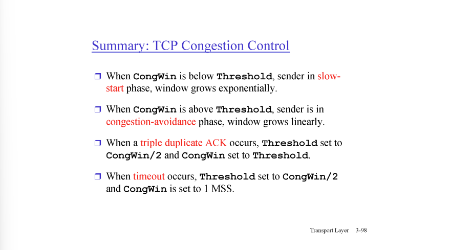

---

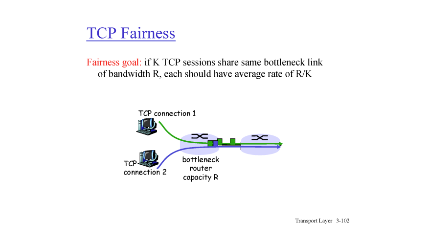

각각 R/2 씩 쎃으면 좋겠는데 실제 그렇게 될까? 궁금함 공평하게 분배 될까?

A : fair 함!

---

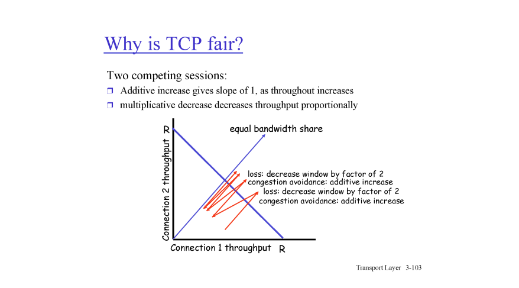

결국 equal bandwidth share로 수렴함

tcp conjestion control은 결과적으로 분산 동작해도 모든 TCP가 fair 해짐

tcp connection 많이 연 사람이 많이 씀

---

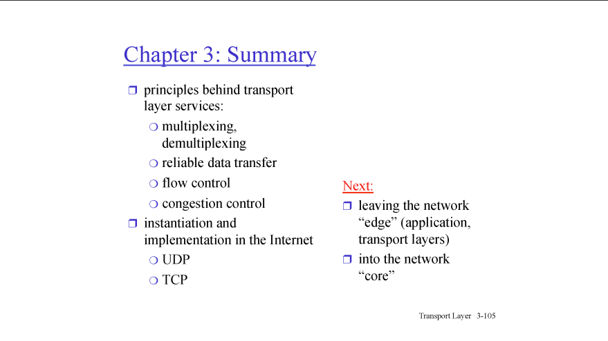