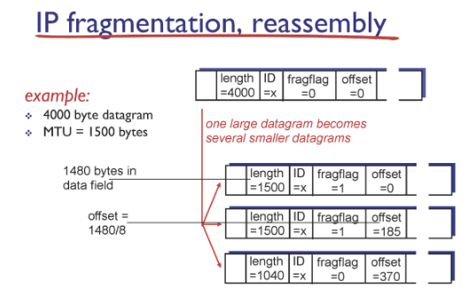

Q1 : DHCP의 client와 server간 IP주소를 배정하는 과정을 크게 4단계로 나눠 설명하시오.

A1 : DHCP discover

client가 server에 IP 주소를 요청함

subnet의 모든 호스트들이 해당 메세지를 받긴 하지만 DHCP server만 listener를 열고 나머지는 닫혀있어 결국 버려짐

DHCP offer

DHCP 또한 subnet 전체에 offer를 보내지만 IP 주소를 요청한 client만 메세지를 사용함

DHCP request

offer를 받은 client는 request를 보내 해당 서버를 사용하겠다고 말함

이 때 transactiond에 1을 더해 보내 이외의 server들은 선택받지 못했음을 표시

DHCP ACK

최종적으로 DHCP server가 client에게 ACK를 보내 IP 주소를 배정

Q2 :  IP를 전송할 때 datagram이 특정 링크에서 최대 전송 크기를 초과할 경우 어떻게 전송되는지 설명하고 이 때 활용되는 IP datagram의 header 요소 3가지를 기술하시오.

A2 :

identifier, flgs, offset