자기자신의  distance vector값이 변경되면 이웃에게 전달

계속 반복

어느 순간 stablize 되는 순간 옴

link cost 바뀌면 이웃들 다시 값 바꾸기

우리 네트워크 안에 라우팅은 우리가 알아서 결정

전체 라우팅 문제는 어떻게?

---

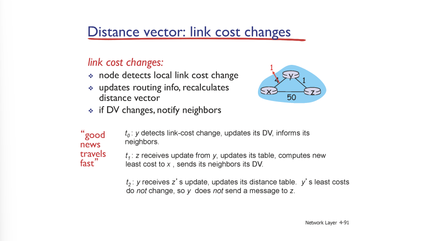

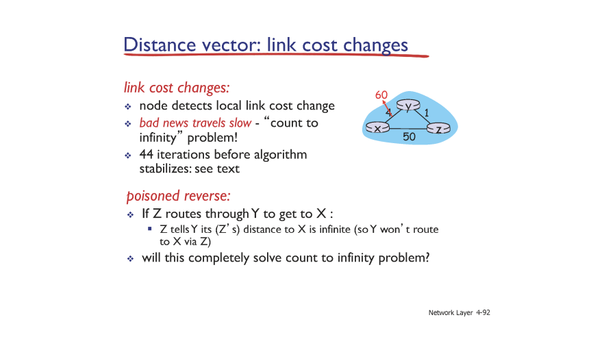

count-to-infinity

경로를 계산하는데 결정적인 역활을 한 노드에 정보를 보낼 때는 infinity로 보냄 => poisoned reverse

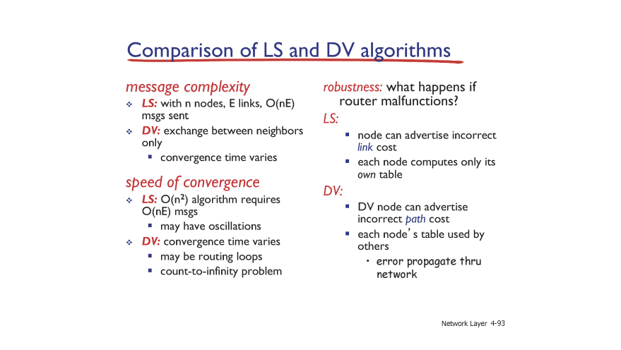

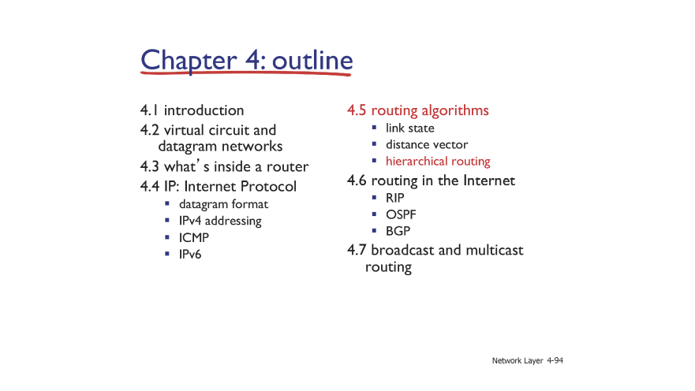

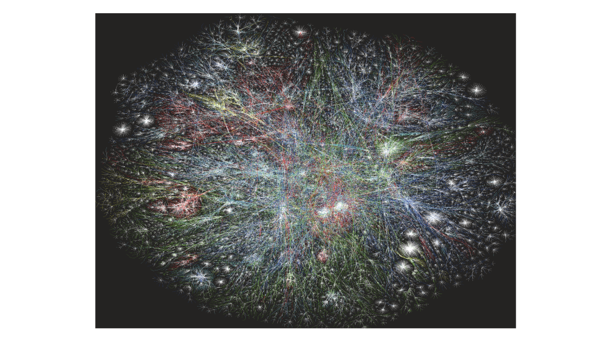

linked-state => 현실적으로 불가능

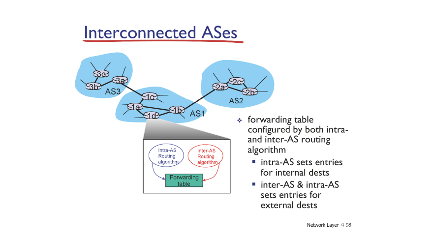

대칭화 시킴

AS => 자치권을 가진 시스템

Inter-AS routing => AS간의 routing 알고리즘

BGP : inter-as routing protocal (성질이 조금 다름)

intra-AS routing

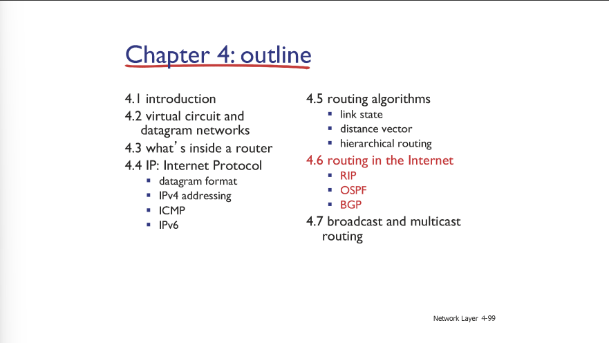

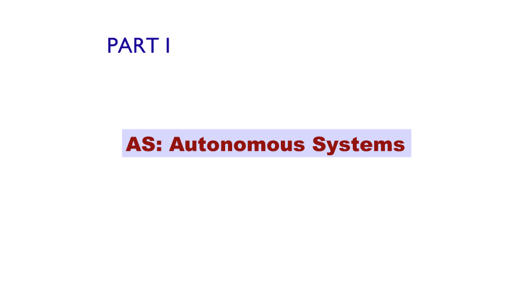

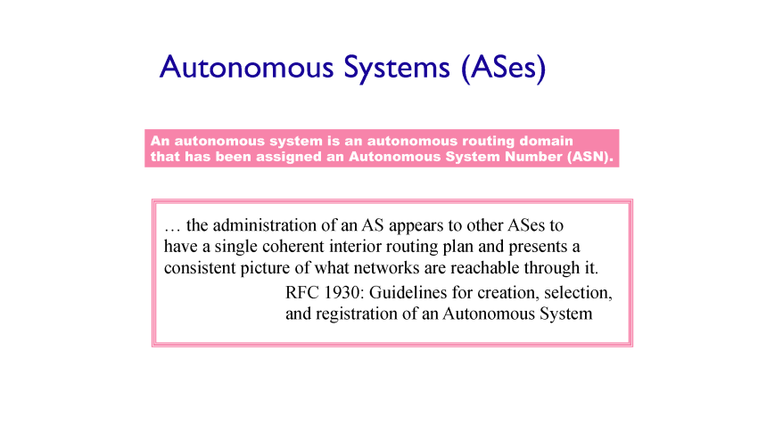

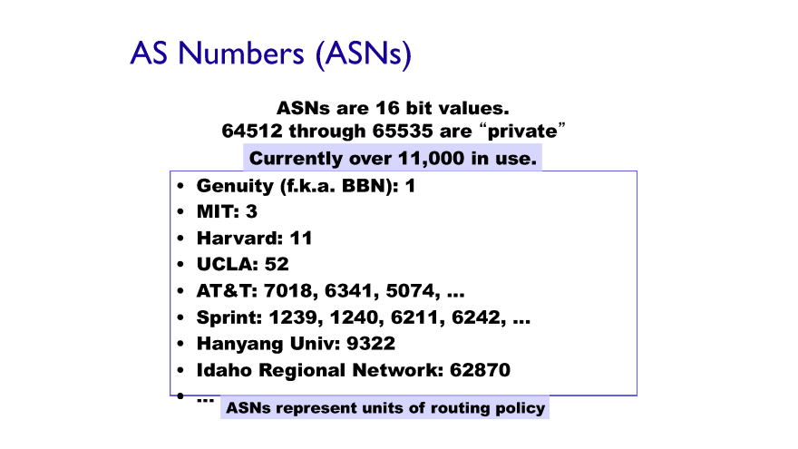

모든 AS는 각자의 AS Number를 갖고 있음

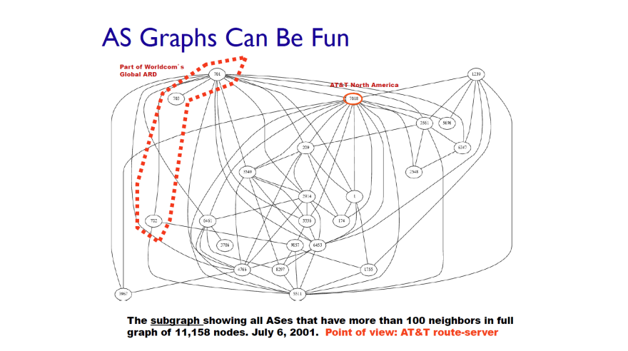

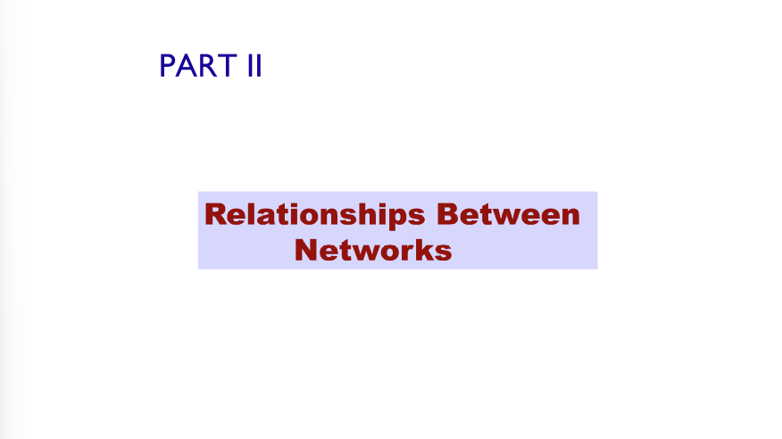

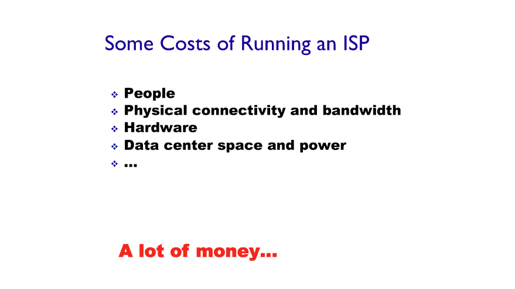

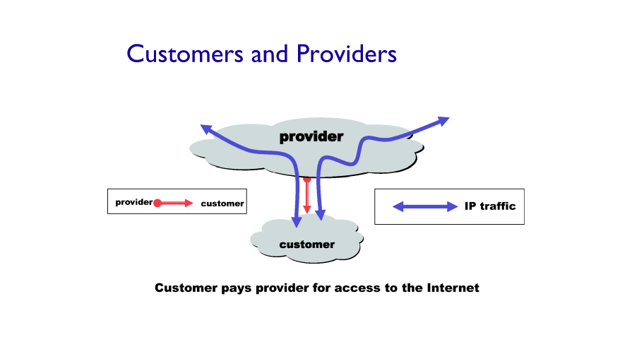

provider 인터넷 연결 제공 AS

customer 인터넷 연결 사용 AS

한번 맺어지면 트래픽 왔다 갔다 가능

갑(provider)-을(customer) 관계

ex) 한양대 vs KT

상대적임

ex) KT vs 북미

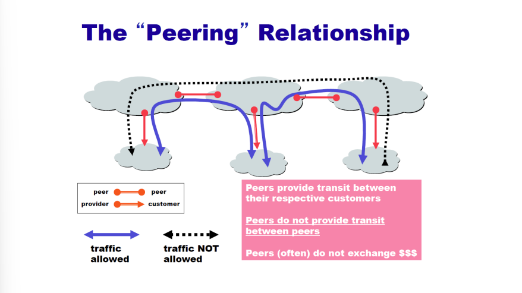

ex) SKT vs KT

Peering Relationship

linked-state 구현 불가

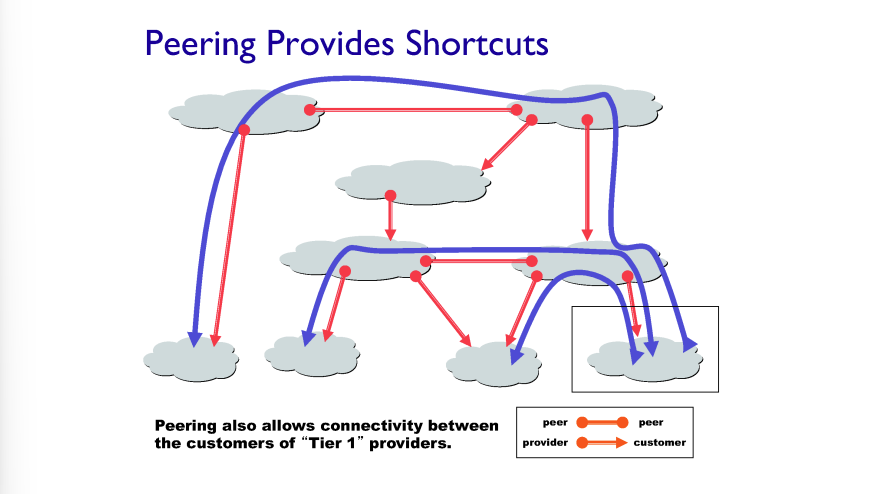

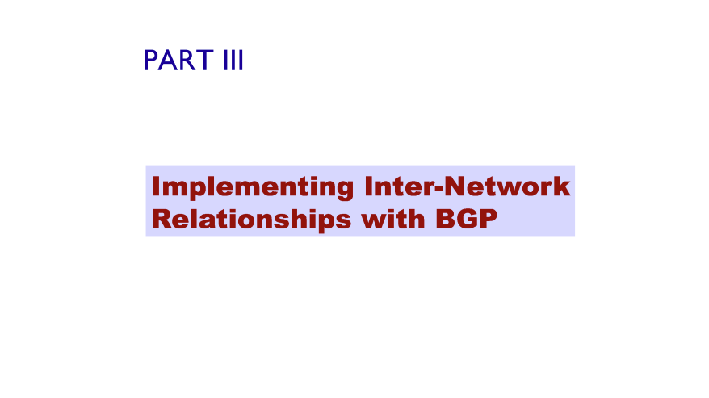

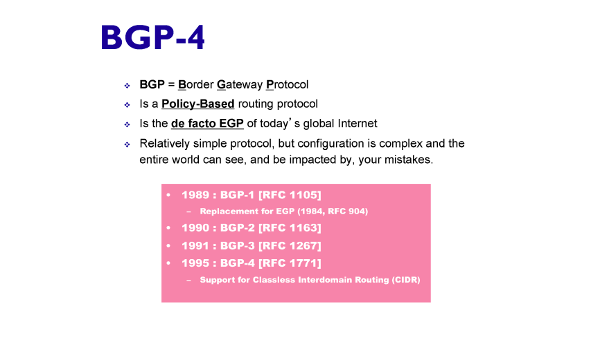

AS들의 경계에 있는 게이트웨이 라우터에서 어떻게 라우팅 할건지

Policy-Based : 최적화 시키는게 cost가 아니라 AS간의 정치?적 상황 기반

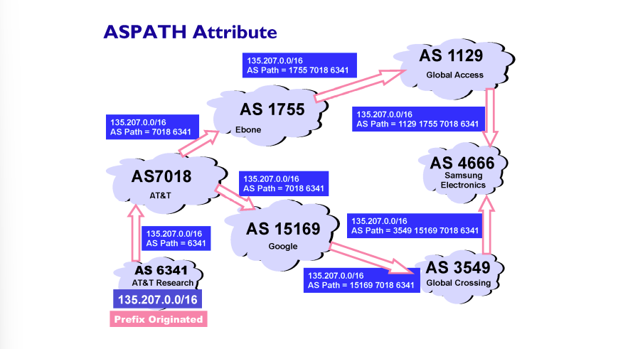

Traffic 거치기 꺼림칙한 애들 순회해서 가고 그럼

기왕이면 돈이 덜 드는 곳

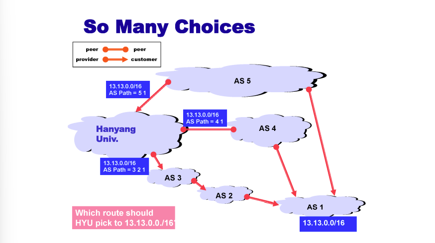

내가 갑의 위치에 있는 경로가 우선 => 돈이 안듬

따라서 가장 아래 길을 선택함 (business protocal) => 최단 경로는 아닐 수 있음

AS 내부에서는 최단경로, AS 끼리 경로는 가장 경제적인 경로

Intra - AS 목적 : 최단 경로

Policy 어쩌구 => 최단 비용?