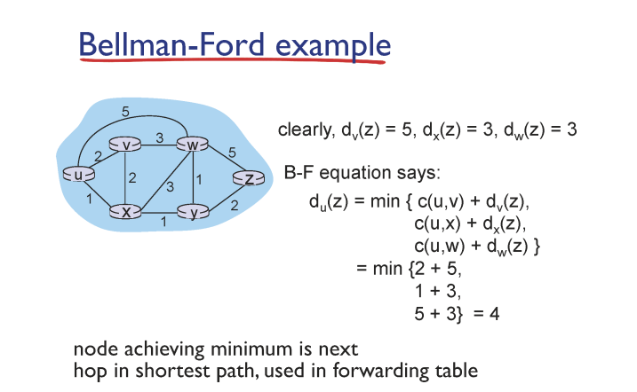

# Routing Algorithm: Distance Vector Algorithm

## Bellman-Ford Algorithm

## Distance Vector Algorithm

### $d_x(Y) = min[C(x, v) + d_v(Y)]$

✔ $d_x(Y)$: x에서 y로 가는 추정 최단 경로

### 개요

✔ 각 노드가 **자신이 알고 있는 다른 노드까지의 거리(vector)를 인접 라우터에 전달**한다.  
✔ 전달 조건 : **distance vector에 변경 사항이 있는 경우**

- **distance vector(알고 있는 최단 거리)에 변화(update)**가 생기거나
- **인접 라우터의 link cost가 변경**되어 distance vector가 변경된 경우

✔ 인접 라우터에 대해서 재귀적으로 수행해 최단 경로를 구한다!!

✔ 더이상 update가 없어지면 모든 최단 경로를 구한 것이므로 중단!

### 예시

### Count-to-infinity
✔ 네트워크에서 한 연결이 끊어지거나 link cost가 증가했을 때 라우팅 loop를 돌게 되는 현상  
✔ 전체 연결 상황을 모른 채 부분적인 정보만 의존해 계산을 하게 되어, 상대방이 보내는 distance 정보가 자기 자신에 의존적인 경우 발생하게된다.   
✔ **Route Poisoning (Poison reverse)**
- 라우터 연결이 끊어지거나 link cost가 증가해서 loop를 돌게 되었을 때 해당 라우터에 대한 **'badnews**'를 네트워크에 전파해, **해당 연결의  distance를 infinity로 라우팅해 loop를 방지**한다.