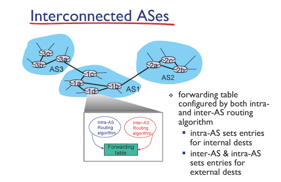
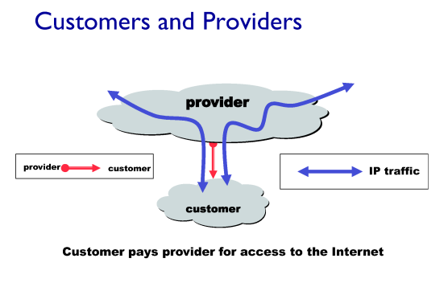
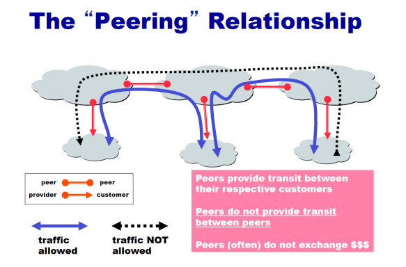
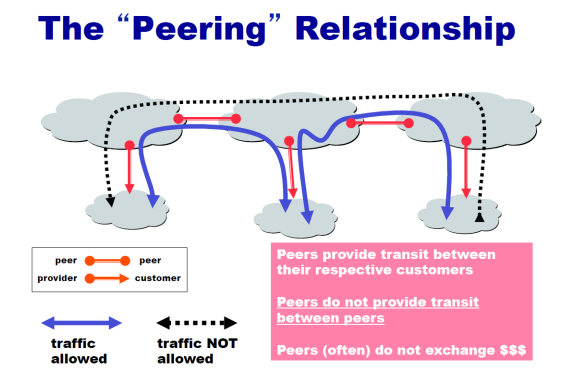
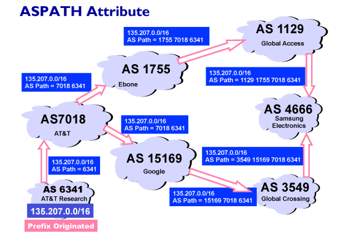
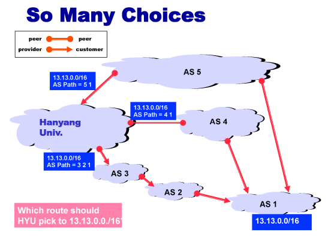

# Hierarchical Routing

## Interconnected ASes

  
✔ **AS(Autonomous Systems)**: 각각의 네트워크들 내부는 독립적인(자체적인) 라우팅 시스템(알고리즘)을 가진다.  
✔ 네트워크들은 다시 계층적으로 연결되어있다.

### Intra-AS routing

✔ **AS 내부에서 동작**하는 라우팅 프로토콜  
✔ Distance Vector, Link State  
✔ 최소 비용, 최단 경로라는 확실한 목적

### Inter-AS routing

✔ **계층적으로 연결된 AS들을 잇는** 라우팅 프로토콜  
✔ Hierarchical routing (BGP)  
✔ 정치적, 경제적 이유들로 최단/최소비용 경로 목적 x

## Relationships Between Networks

### Provider - Customer 관계

  
✔ AS 사이에도 Provider - Customer 관계가 존재한다.  
✔ 상대적인 관계!

### Peer-Peer 관계

  
✔ 둘이 비슷한 관계일 경우 (ex - 두 통신사 간 관계)
 

✔ 검은색 점선은 경제적 논리로 인해 연결이 되지 않는다.(이득이 없음)
 
✔ 해당 검은색 점선을 이어주는 게 BGP!

## BGP

### 개요

✔ **BGP - Border Gateway Protocol**  
✔ **Policy Based** routing protocol

### ex) AT&T Research-> Samsung Electronics

  
✔ **많은 고객을 얻을 수 있는 path** 선택  
✔ 경로를 선택할 때 path 내의 **네트워크 host도 고려**해서 판단하게 된다(Policy Based).  
✔ Customer > Peer > Provider
 

### Many choices

  
✔ 최단 경로가 아니라 **자신이 provider가 되도록 하는 path**를 선택한다.
 

✔ 결국 BGP는 최단/최소비용 경로가 아닌 경제적/정책적 요인들을 고려한 경로를 결정한다.
