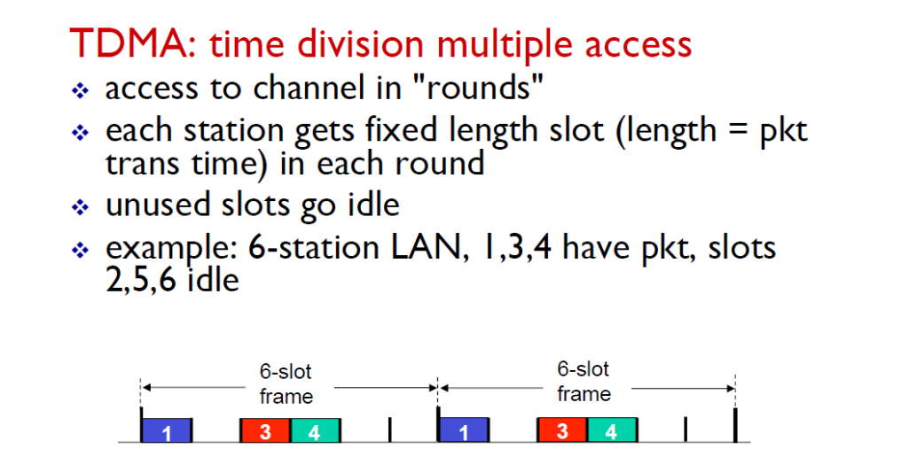
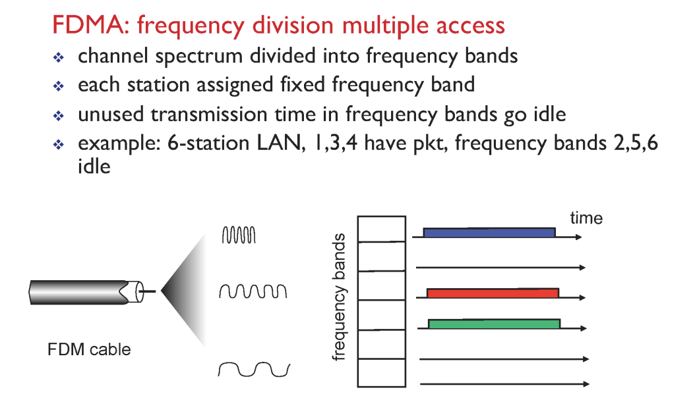
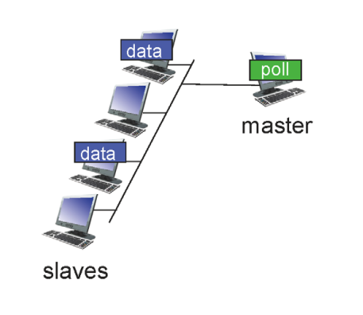
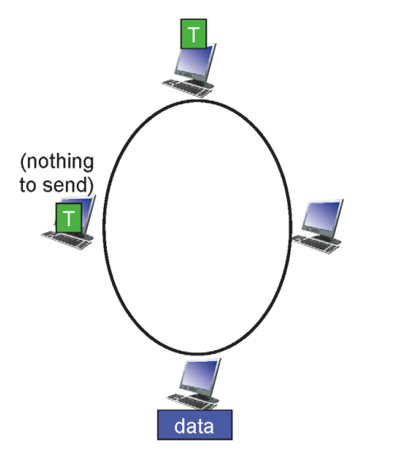

# Link Layer: Introduction

## Introduction

✔ **Link**: 인접 네트워크 상의 노드 사이를 연결하기 위해 사용되는 물리적/논리적 네트워크 구성 요소

✔ 한 Hop을 넘어갈 때(한 node에서 다음 인접 node로 데이터를 전송할 때) 어떻게 충돌 (collision) 없이 넘어갈 수 있을 것인가

## Where is the link layer implemented?

✔ **Network Interface Card(NIC)**에 어댑터 형식으로 구성

## Multiple access links, Protocol

✔ 현실의 네트워크는 각각 host-client 전용선이 아니라 **여러 사람이 공유하는 채널인 경우가 많음(broadcast medium)**

✔ **Medium Access Control(MAC)**: 매체에 대한 접근을 조절해서 충돌을 최소화 하는 기술

### Ideal Multiple Access Protocol

✔ R(bps): link의 channel bandwidth  
✔ 다음과 같은 조건들을 만족하는 이상적인 MAC 프로토콜

1. 한 노드가 데이터를 전송할 때 온전히 R의 속도로 보낸다.
2. M개의 노드가 데이터를 전송할 때 평균적으로 R/M의 속도로 보내지게 된다.
3. 분산 처리 (decentralized)
4. 단순한 방식 (simple)

## MAC protocols

1. channel partitioning
2. random access
3. taking turns

## 1. Channel Partitioning

### TDMA

  
✔ **TDMA: Time division multiple access**  
✔ 각 채널별로 자신이 전송할 수 있는 **time slot을 배정**해서 해당 slot이 돌어왔을 때만 데이터를 보낼 수 있게 한다.  
✔ user(채널) 수에 따른 자원 낭비 발생 가능

### FDMA

  
✔ **FDMA: Frequency division multiple access**  
✔ 각 채널 별로 **주파수** 배정  
✔ TDMA와 같이 자원 낭비 문제 발생

## 2. Random Access Protocols

✔ 데이터를 보내고자 할 때 그대로 R 속도로 보냄  
✔ 두 채널 이상 데이터를 보낼 때 충돌 발생! -> **충돌 탐지/처리** 방식 중요

### CSMA

✔ **CSMA:(Carrier Sense Multiple Access)**  
✔ **listen before transmit**: 데이터가 전송 중이면 대기, 전송 중인 데이터가 없으면 데이터 전송  
✔ 인간의 소통 방식과 유사

#### CSMA collisions

✔ **propagation delay**로 인해 node로 전달되는 시간 차가 존재해서 충돌 발생  
✔ propagation delay는 줄일 수 없기 때문에 **충돌 자체는 불가피하다**

### CSMA/CD (Collision Detection)

  
✔ CSMA 방식에서 충돌이 발생했을 경우 즉시 전송을 멈춤!  
✔ 중단 이후 재전송 방식: **NIC enters _binary_**

- M번의 충돌이 있었으면 {$0, 1, 2, ..., 2^M - 1$} 중 하나의 수를 **random하게 선택**해서 대기
- 충돌이 많아질 수록(사람이 많아질 수록) 선택하는 random 숫자의 범위도 증가 -> 오래 기다릴 가능성도 증가

## 3. Taking Turns

✔ Channel partitioning과 random access의 절충

### Polling

✔ mater node가 slave node의 데이터 전송 조율  
✔ master node에 문제 발생 시 네트워크 전체에 영향!  

### Token Passing

✔ 토큰을 가지고 있을 경우 데이터 전송 가능  
✔ 전송할 데이터가 없으면 다른 node에 토큰 전달  
✔ 그러나 중간에 token 유실 시 문제 발생 가능 (Single point of Failure)