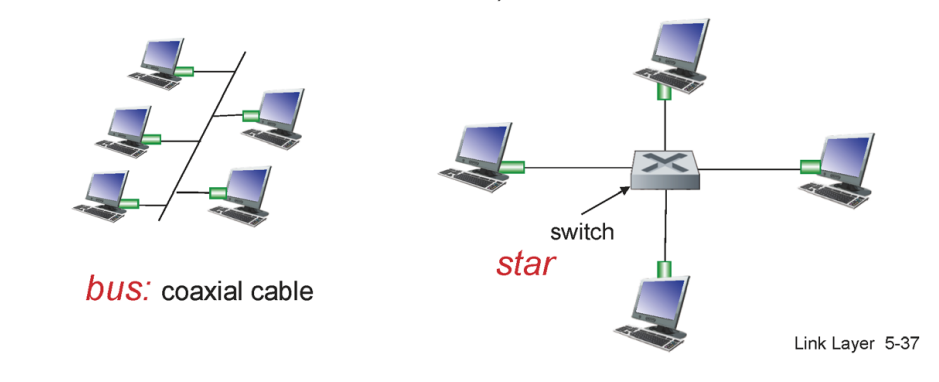

# LANs: Ethernet

## LAN
✔ LAN: Local Area Network  
✔ 네트워크 매체를 이용하여 가까운 지역을 한 데 묶는 네트워크

## Ethernet
✔ LAN에서 충돌 방지를 위해 사용하는 가장 대표적인 프로토콜  
 
  
✔ 오른쪽 방식이 오늘날 더 보편적인 형태  

### Ethernet Frame Structure

✔ preamble  
✔ dest/source address: MAC address 
✔ CRC: 에러 체킹  
✔ type: 상위 레이어의 어떤 프로토콜인지 명시(주로 IP 프로토콜)  

### Ethrenet CSMA/CD
✔ 로직은 기본적인 CSMA/CD와 동일  
✔ CSMA/CD는 collision detection이 있었을 때만 데이터를 재전송 / collision이 detect되지 않았을 경우 잘 전송되었을 것이라고 판단 -> **MAC layer로부터 따로 ACKs를 받지 않는다!**  
✔ 그런데...

#### Collision이 발생했는데 detect하지 못할 수 있다??
✔ **Propagation Delay**로 인해 collision을 채 detect하기 전에 메세지를 다 전송하면 보낸 node에서는 detect하지 못할 수 있다!!   
✔ **Minimum Frame Size 64bit**: Collision Detection을 위한 최소한의 프레임 크기