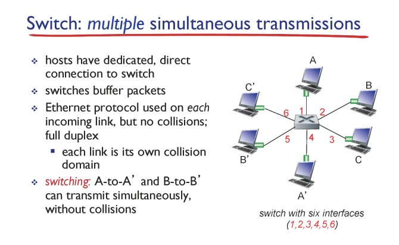
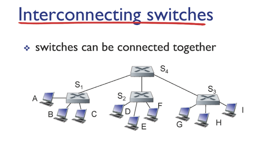
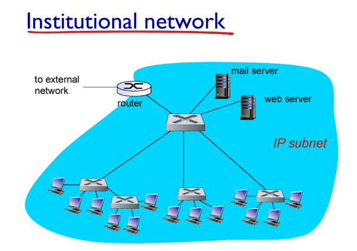
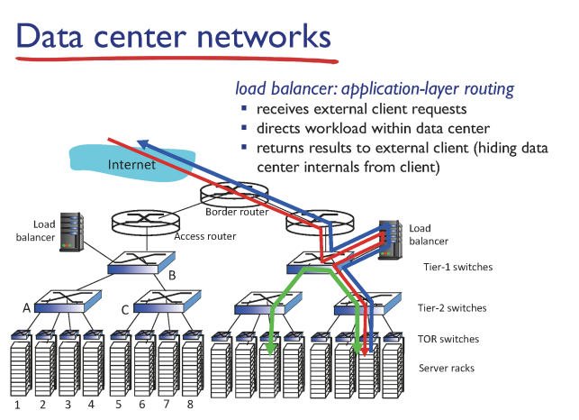

# LANs: switches

## Switch

  
✔ Star: 오늘날 주로 쓰는 이더넷 형태   
✔ **Switch: 네트워크 단위들을 연결하는 통신 장비**  
✔ 하나의 **switch** 중심으로 네트워크 연결   
✔ 편리할 뿐만 아니라 **collision domain을 분리** 시켜준다!!  
✔ host들은 switch의 존재를 인지 못한다.

### Multiple simultaneous transmissions

✔ switching: switch forwarding table 참고해서 데이터 전송  

### Switch: self learning

✔ switch는 switching을 통해 스스스로 switch table을 채워 나간다.  
✔ **Flooding**: 찾고자 하는 주소를 모를 경우(초기) 네트워크 내부의 host 전체한테 보낸다.  

### Interconnecting switches  
  
✔ switch끼리 연결해서 LAN 규모를 키울 수 있다.  

### Institutional Network
  
✔ 기관/학교의 대규모 네트워크도 스위치로 서로 연결되어있다.  

## Switches vs Routers
### switches
✔ Link Layer(switching)  
✔ MAC address  
✔ flooding  

### routers
✔ Network Layer  
✔ IP address  
✔ routing algorithms  

## Data Center Networking
  
✔ 대규모 Data Center도 switch로 계층화 되어 연결되어있다.
