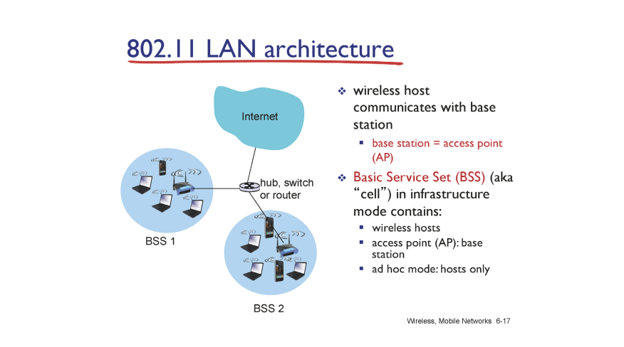
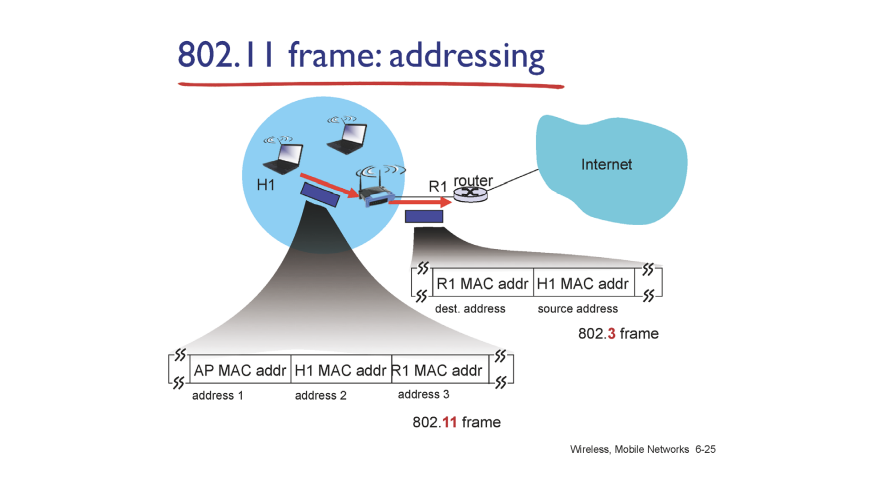

# Wireless and Mobile Networks

MAC : 충돌 관리 ( 유선 링크 상황에서), CSMA/CD

무선에서도 MAC protocol 필요하니깐!

개념적으로는 거의 동일함

유선 인터넷 사용했을 땐 link 라는 broadcast 공유해서 생기는 문제!

무선도 공기라는 mdeium이라는 broadcast 공유해서 충돌 발생!

but, link만의 차이 있긴 함

---

네트워크 관점에서의 이동 => AP를 바꾸는 차원의 이동, 네트워크가 바뀌는 차원의 이동 이어야함

노트북 랜 선없어도 Mobility는 아님

but smartphone 버스타고 쭉 이동해서 이동하는건 이동임

mobility : connectivity 있는 상황에서 network 넘나 드는 것

단순히 선 없는건 wireless (wifi)

---

첫 홉만 무선, 나머지는 유선!(기존과 동일)

무선, 한 홉을 어떻게 갈 것인가

---

wifie, 전송거리 짧은 애들 802 애들

b(90년대 말), a, n(최근) 순으로 나옴

데이터 속도는 점점 좋아지는데 전송 반경은 짧음! (주로 indoor 사용)

전송 반경이 긴 것들은 cellur network에 사용하는 internet technology

---

infrastructure 유무로 구분, 유선이 single, multiple hop 인지

infrastructure, multiple hop은 거의 없긴 함(흔치 않음)

일상에서 보는 대부분의 경우는 infrastructure, single hop의 경우

---

유선 인터넷에서는 cable로 signal 전달

무선은 거리 늘어날 수록 신호 세기 exponential 하게 감소함

외부러부터 간섭이 심함(개방된 매체)

---

A signal을 C에서 거의 안들림

Hidden terminal problem : A가 전송하고 있는지 C가 알 수 없음(A가 B한테 signal 보내고 있는지 알아야 최소한 방해는 안할 텐데)

wrieless 특징 : Collision Detection 불가능

내가 하는 signal 때문에 다른 signal 안들림!

---

Wi-Fi (Wireless Fidelity, 유선의 특징에 가까이 가보자)

Hi-Fi (오디오 원음에 가까이 가보자)

---

ap(이더넷 케이블 꽂혀서 switch에 연결)

하나의 BSS(Basic Service Set)  구성

---

모든 ap들은 자기 자신의 정보를 주기적으로 broadcast 함(초당 10번~)

host들이 정보를 가지고 판단

가장 믿을만한 ap, signal 세기에 보냄

---

CSMA/CD 사용할 수 있나?

A가 하는 얘기를 C가 못듣는데

A가 데이터 보내고 있을 때 C는 충돌 감지 못해서 그냥 데이터 보내가 잘 갔구나 하고 끝냄

충돌은 발생하는데 충돌 감지 안됨..

유선 이더넷 핵심 => 충돌 났다! === 데이터 안감 => 재전송 (충돌 안날 때 까지)

유선 이더넷에서는 link layer에서 ACK 없음 ( 내가 충돌 감지할 수 있으니깐 내가 충돌 감지만 하면 갔는지 안갔는지 알 수 있음)

충돌은 발생하는데 충돌 감지가 안되면 제대로 갔는지 안갔는지 ACK가 필요함

---

Wireless MAC Protocol : CSMA/CA

IFS 만큼 캐리어 센스 했는데 조용하면 데이터를 보냄

receiver는 제대로 받았으면 SIFS 기다렸다가 ACK 보냄

sender : ACK 받았을 때만 데이터가 잘 갔음 판단

캐리어 센스 했는데 안조용하면 기다림

유선은 CSMA/CD에서 충돌 감지하면 바로 멈춤

but 무선은 충돌 발생하며 다 날라가서 피해가 더 큼

=> 충돌 더 조심해야함

근데 충돌 CSMA/CA는 더 노력하는 건 없음 => 동작은 하는데 그냥 ACK 받을때 까지 가긴 감

---

Control Frame

RTS(Ready To Send)- CTS(Clear To Send)

RTS 먼저 던져봄(작은 돌)

충돌나면 AP는 그냥 noise로 받아드림(CTS 못보냄)

random 시간 후 RTS 다시 보냄(A가 먼저 보냈으면 CTS(A) 보냄)

RTS에는 얼마만큼의 크기를 얼마만큼 보낼거다 하는 정보 담겨 있음

따라서 주변애들은 지금 A가 보낼라 하는구나 알 수 있음

AP 통신 반경 애들은 CTS 다 듣게 됨

데이터 다 받으면 ACK 받음

A 다 보낼 동안 B는 조용한데 RTS 얼마 시간동안 보내지 않음(지금 보내면 충돌이겠구나)

CTS(A) 잘 갔는데 동시에 B도 RTS(B) 보냈을 때 (RTS, CTS 섞임)

사람 별로 없을 때는 MAC layer 평화로운데 사람 많아지면 난리남(채널 차지 경쟁)

CTS받기 전에 데이터 들어오면 충돌 === 데이터 날라감

ACK 못받음 재전송

random protocol : 사람 적으면 잘 사용하는데 사람 많으면 충돌 계속 반복

WIFI Standard : 7번까지만 재전송 해라

포기된 frame은 돌고돌아 TCP에서 다시 전소앻줌

---

---

