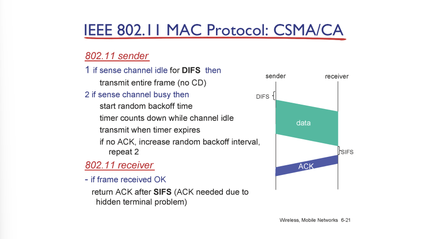
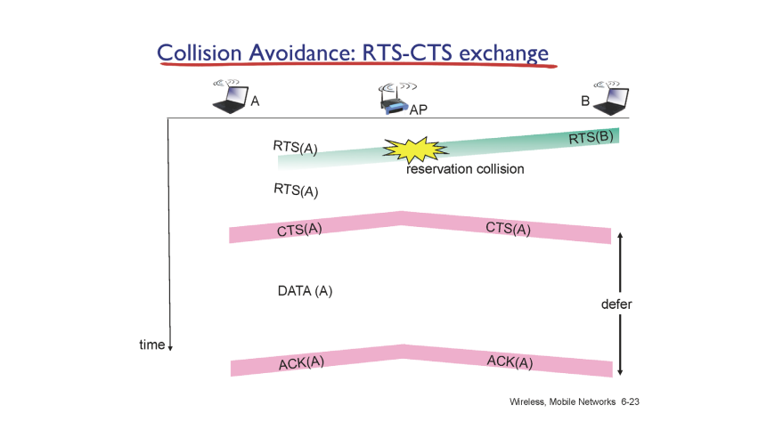
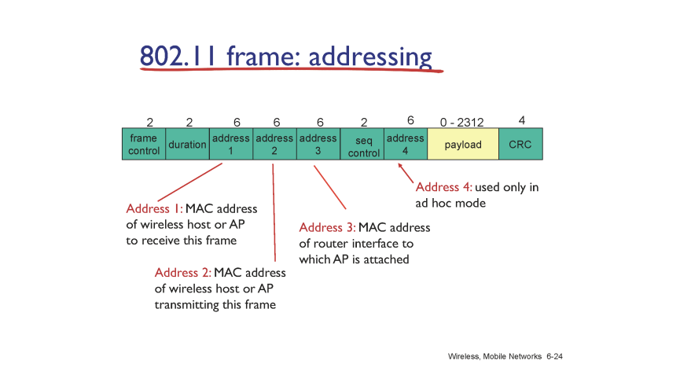
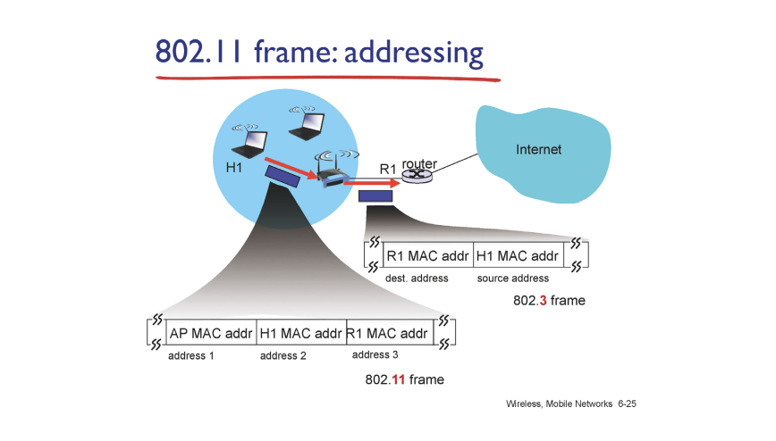
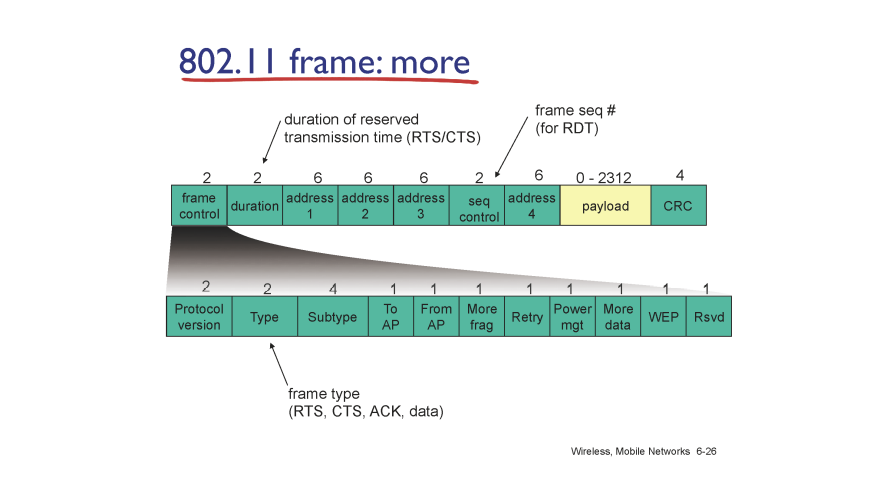
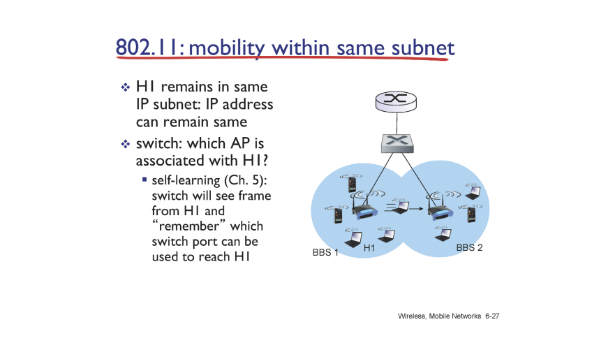

# Link Layer 2

wifi 주파서 대역 2.4GHz

unlicensed base (자유롭게 쓸 수 있음)

11개의 sub channel로 이루어져 있어서 11개 채널 중 선택해서 사용하는 방식 취함

어떤 채널 사용할지는 ap들이 선태갛고 우리는 따라 씀

채널들이 overlap 되지 않으면 각 부분 호스트들은 간섭이 일어나지 않음

각 부분이 서로 overlap되는 채널 쓰면 같은 도메인이라 간섭이 일어남 => CSMA/CA + RTS, CTS로 해결

ap들이 많아질 수록 경쟁 심해져서 혼잡해지고 시간지연 일어남

---

---

wifi frame 구조

address field 4개나 됨, 4번은 무시해도 됨

address1 은 mac address 받는 frame address

address 2 는 frame전송하는 mac address

3은 router adress

---

router는 ap 있는 줄 모름?

ip packet source: H1 ip, destination : google

ap가 받아도 이해 못함

router넣어 보내도 router 없어서 받지 못함

따라서 AP가 받아서 

link layer device라서 address 3개, ap는 거의 switch라서 안보이는 애임

AP MAC addr : 주변 애들이 자기 정보 담은 비콘(?) 들 주기적으로 broadcast 하니깐 알 수 있음

내가 누군지는 어떻게 암? DHCP로 내 IP,  subnet mask, gateway router ip, local name server ip 알게됨

AP 만 안 상태에서 DHCP request 보내야함

address 3 은 broadcast frame 담긴 data 부분에 ip packet 담겨 있음

R1 MAC 주소 알려고 : ARP table 참조해서 ARP query 보냄 (broadcast)

broadcast source에는 h1

나갔다 돌아올때

add 1 : broadcast

add 2 : AP

add 3 : ???

---

---

이동 했을 때 IP 바꼈는지가 중요

TCP 요소 4개 중에 바뀔리가 없음

source ip 바뀌면 끊김

근데 3g lte 쓸 때 ktx타고 가도 왜 안바뀔까? TCP 요소 유지됨

같은 네트웤인데 범위가 엄청 큰거

