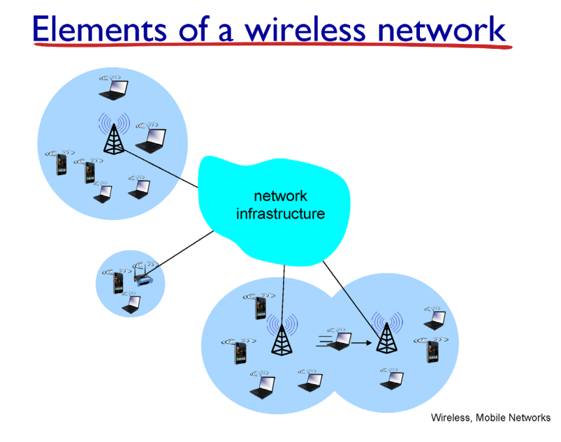
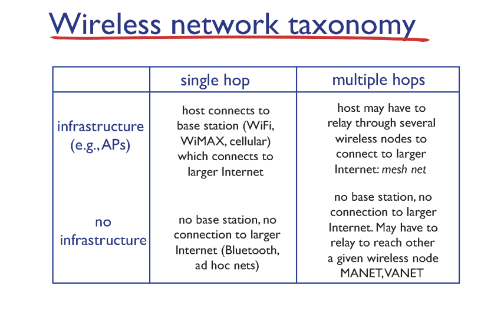
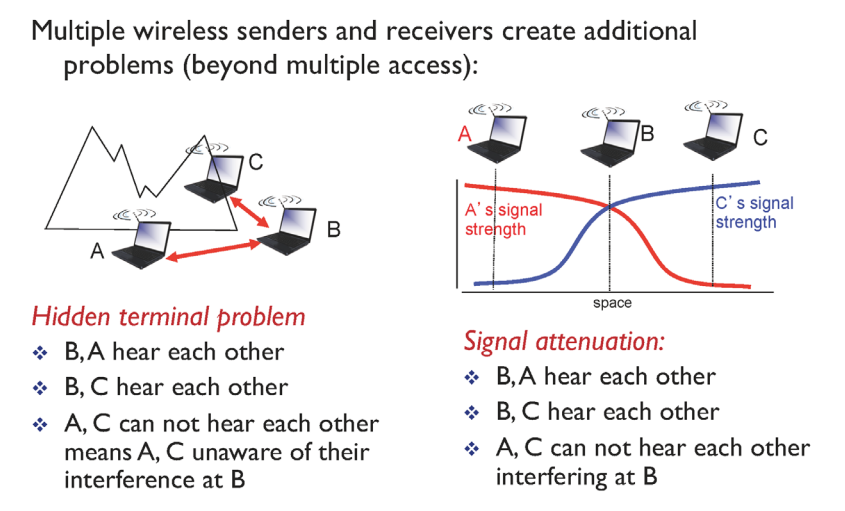

# Wireless Networks: Intro

## Introduction

✔ 대부분의 경우가 single hop & infrastructure이다.  
✔ 첫 hop만 무선이고 결국 나머지는 유선이다!  
✔ 결국 첫 hop을 어떻게 넘기느냐가 중요! -> Link Layer

## Characteristics

✔ 유선 환경과는 다르게 시그널이 전달될 때 보호 받지 못한다.  

✔ CD(Collision Detection) 불가능!!  
- **Hidden Terminal Problem**  
- 자기 자신이 보내는 signal의 세기가 다른 signal을 가린다.  

