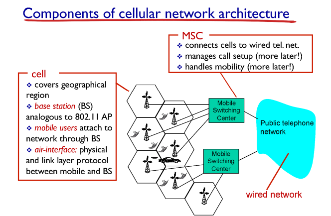
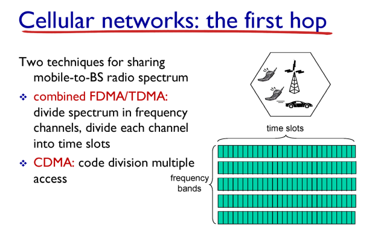
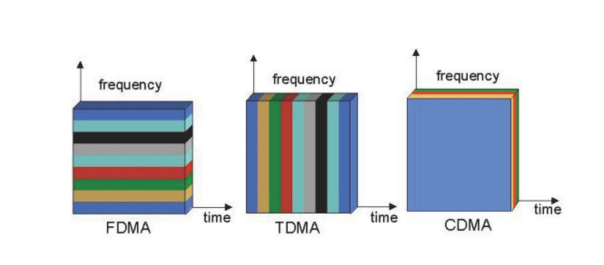

# Cellular Internet Access

## 개요

## Cellular Network의 MAC protocol

✔ Channel Partitioning(FDMA, TDMA) 방식 사용

### Code Division Multiple Access CDMA

✔ 섞어서 보내되, 각 사용자에게 다른 code를 부여해서 noise와 data를 구분  