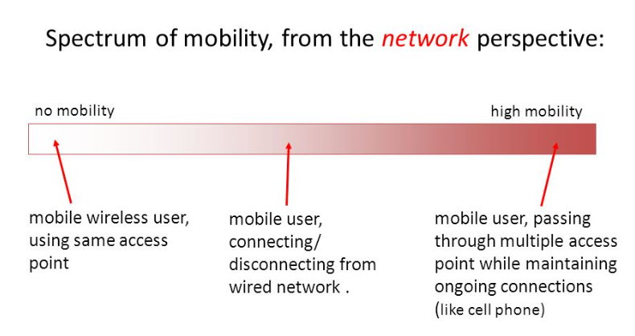
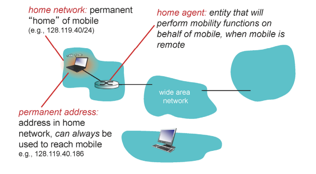
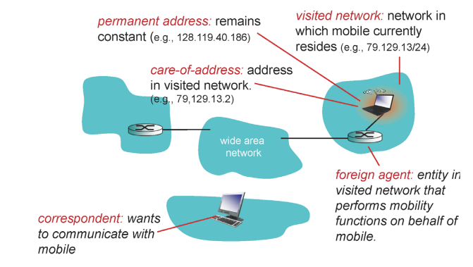
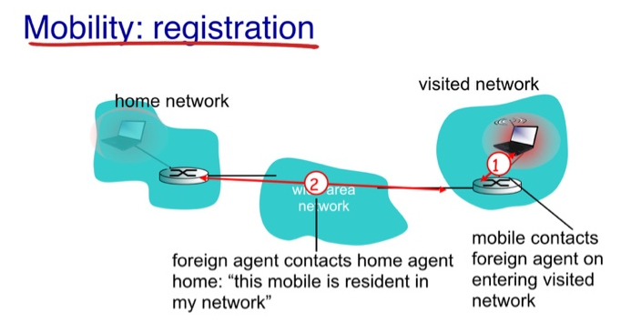
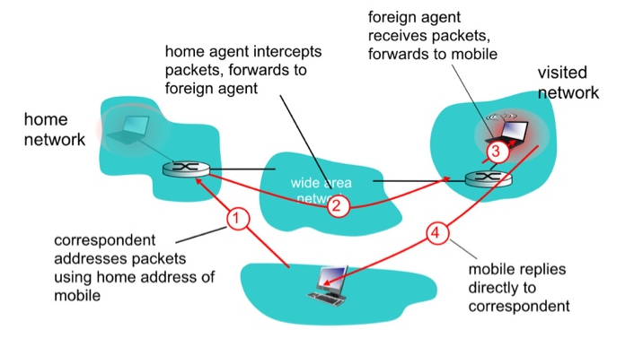
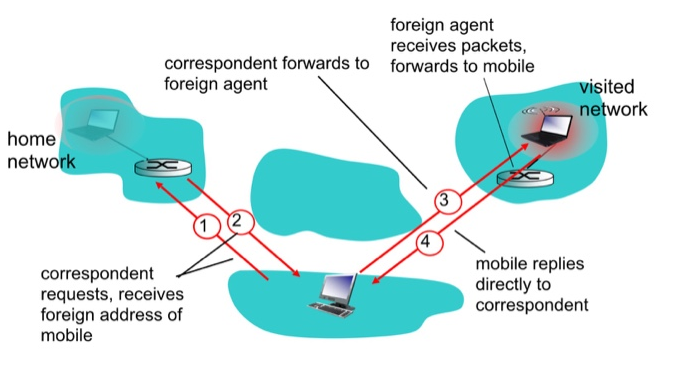

# Mobility

## What is mobility?

✔ High Mobility: 계속 TCP 연결을 유지한 채로 네트워크를 이동  

 
✔ **이하 내용은 실제 존재하는 것이 아니라 mobility에 대한 개념적인 내용이다.**

### vocabulary

✔ permanent address  
✔ home network  
✔ home agent  
✔ visited network  
✔ care-of-address  
✔ correspondent  

## Mobility: registration

✔ foreign agent는 home agent 한테 mobile host가 visited nework에 접속햇음을 알려준다.  
✔ mobile host가 어디로 이동했든 간에 home agent는 mobile host의 위치를 알 수 있게 된다.

## Mobility routing

### indirect routing

✔ 외부 host가 mobile host에 접근하고자 할 때 permanent address로 패킷을 보내면 home agent가 mobile host가 위치해있는 foreign agent로 forwarding  
✔ 장점: 간편하다  
✔ 단점: 오래 돌아가기 때문에 딜레이 발생 가능성!  

### direct routing

✔ home agent가 forwarding을 해주는 것이 아니라 mobile agent의 위치를 알려준다.  
✔ 장점: indirect와 비교했을 때 직접적으로 연결  
✔ 단점: 외부 host가 해야할 일이 늘어나게 된다  

