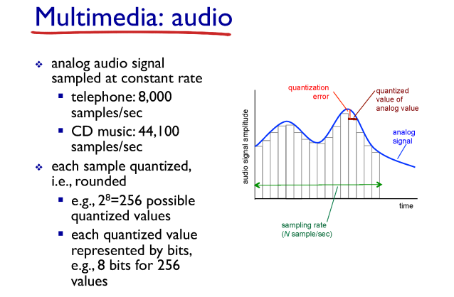
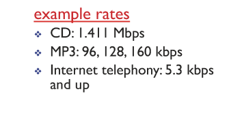
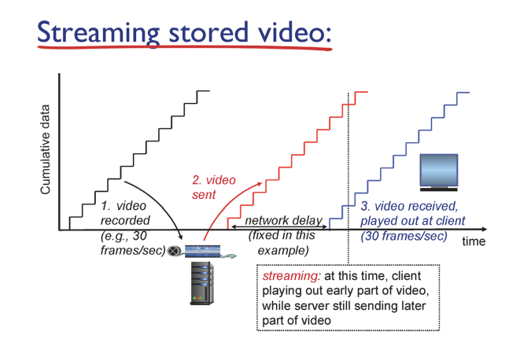
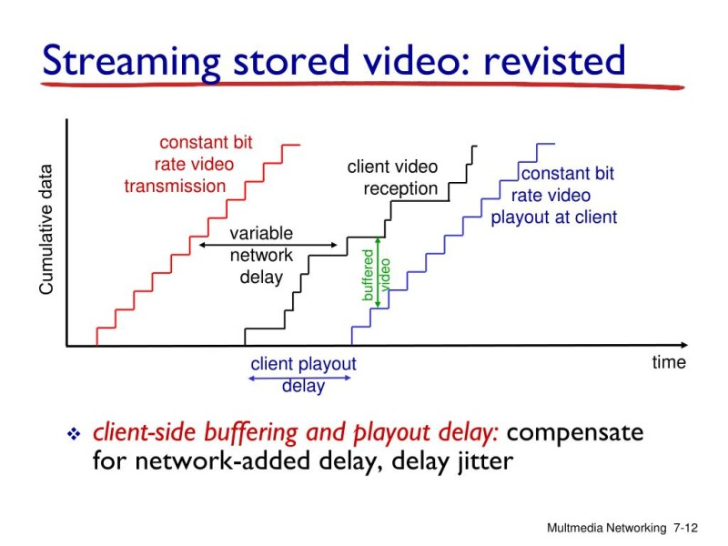
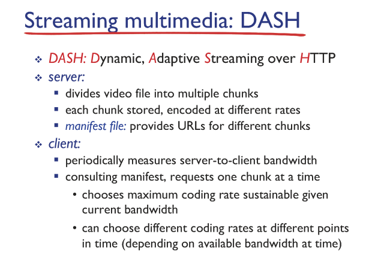

# Multimdeia Networking Applications

## Multimdeia: audio

✔ **아날로그 시그널(음성)을** 네트워크를 통해 전달하기 위해서는 **정형화된 디지털 데이터로 변환**해주는 작업이 필요!  
✔ **Sampling**  

✔ 코딩 rate에 따라 음질이 원음에 가까워진다.  

## Multimedia: video

✔ video는 이미지(frame)의 연속이다.  
✔ 각 이미지의 픽셀에 나타나는 색상을 저장  -> 연속되는 픽셀은 비슷한 색상이 나타나는 경향이 있으므로 **압축해서 저장** 

## Multimedia Networking: 3 application types

### Streaming

✔ **저장된** 영상을 client한테 전송 (유튜브)

### Conversational

✔ 사람 간 대화(음성) 전송

### Streaming Live

✔ 영상을 **실시간으로** 전송 

## Straming stored video

✔ 비디오를 저장해뒀다가 frame 순서대로 client 한테 보낸다! 

### buffering

✔ 현실세계에서는 **jitter(딜레이)가** 발생하기 때문에 영상이 끊기는 현상 발생!  
✔ 따라서 일정시간 **딜레이(buffer)를** 가졌다가 영상을 전송!  

### DASH

✔ **DASH: Dynamic, Adaptive, Streaming over HTTP**  

#### server

✔ 비디오 파일을 **chunck** 단위로 분리  
✔ 각 chunck는 여러 개의 코딩 rate로 인코딩 되어있다.  
✔ **manifest file:** 각 chunck가 저장되어 있는 **URL** 주소  

#### client

✔ 클라이언트는 서버로부터 manifest file을 전송 받는다.  
✔ 네트워크 속도에 따라 코딩 rate를 선택해 영상을 재생한다.  

그런데 모든 영상 데이터를 한 곳에 둔다면 반드시 장애 발생! 그렇다면...? 

### CDN (Content Distribution Network)  

✔ content가 저장된 storage 자체를 전세계 곳곳에 분산시켜 저장  
✔ client가 manifest파일 기반으로 인근에 있는 CDN storage에 데이터 요청  -> CDN 업체의 DNS 서버가 요청 IP를 기반으로 매핑해준다.  

✔ 사용자에게 가장 hop 수가 가까운 곳에 위치 시키기 위하여 Access Network 근처에 CDN 업체들을 위치 시킨다.  