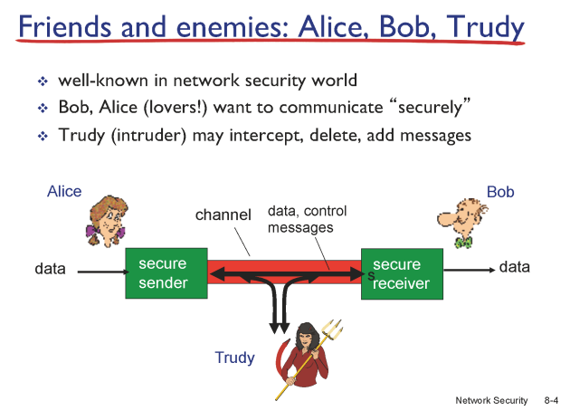
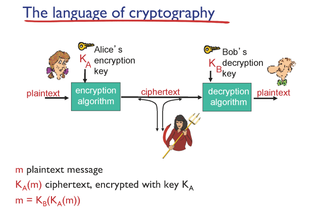
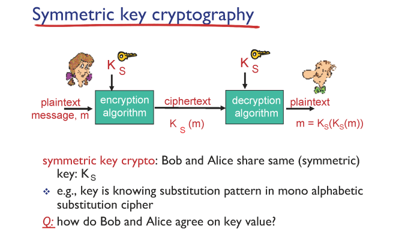
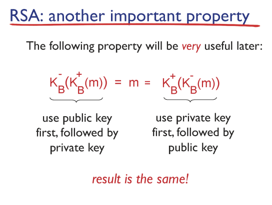
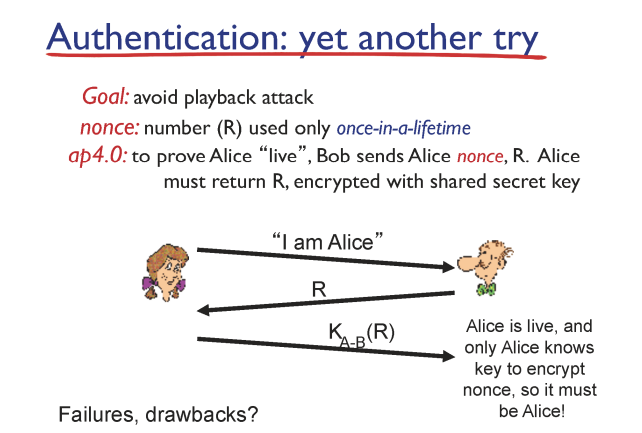
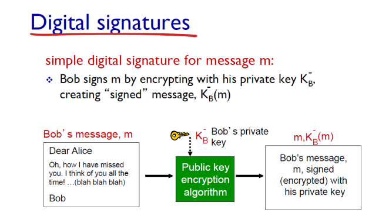

# Network Security

## What is network security

✔ Confidentiality  
✔ Authentication  
✔ Message Integrity  
✔ Access and Availability  

✔ 초기 네트워크 프로토콜 설계 과정에서는 security에 관한 논의가 없었다!!  

### Alice, Bob, Trudy 

✔ 네트워크 보안의 대표적인 비유

### TOR

✔ 3번 우회해서 server에 접근하는 방법! (보안은 보장되나 속도가 매우 느리다)

### Warning

✔ 나가는 ip 패킷의 목적지가 blacklist가 있으면 TCP connection은 형성시키되, 이후 HTTP request가 오면 gateway router에서 TCP connection을 가로채(ip 패킷의 source prt/ip) warning 페이지를 response로 보낸다.  

## Principle of cryptography

### Symmetric Key Cryptography

✔ 키와 메세지가 대칭적이다  

✔ 연산이 적어 빠르고 효율적이나 Alice와 Bob 둘 다 같은 key를 공유해야한다는 단점!  

#### Public Key Cryptoragphy

✔ 모든 사람이 두 종류의 key (public / private)를 가지고 있어서 public key로 메세지를 보내고 받은 사람이 private key로 해독한다!  
✔ 이후 RSA 알고리즘으로 구현

✔ key 적용 순서에 관계없이 같은 값을 얻을 수 있다  
✔ 그러나 연산량이 많아서 메세지 전체보다는 초반에 symmetric key 전달에만 사용  

## Authentication, Message Integrity

### Authentication

✔ Alice가 Alice임을 증명하려면 어떻게 해야될까?

✔ public key cryptography를 통해 검증!

### Message Integrity

#### Digital Signature

✔ public key의 특성(적용 순서와 관계 없이 결과 보장)을 이용해 검증  
✔ message 전체가 아니라 hash 값 (message digest)을 이용한다.

### Public Key는 믿을 만한가?

✔ 신뢰할 만한 인증기관이 public key에 대한 인증서 발급

✔ 인증기관의 신뢰성을 위해 브라우저 자체에 인증기관에 대한 key가 내장되어 있다.  