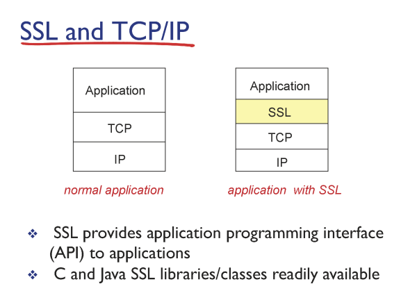
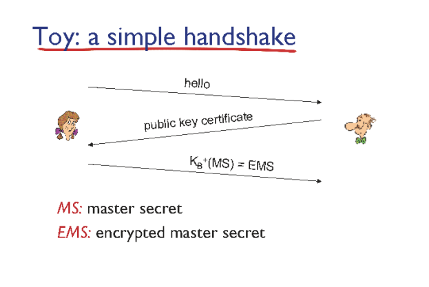
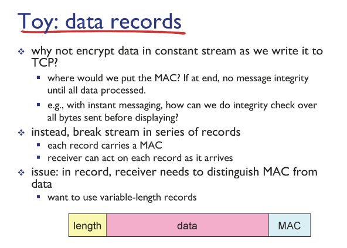
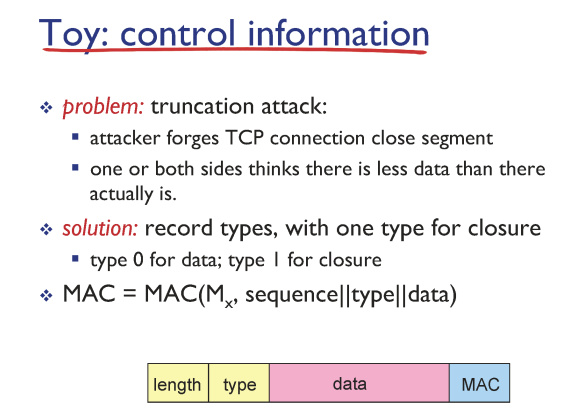
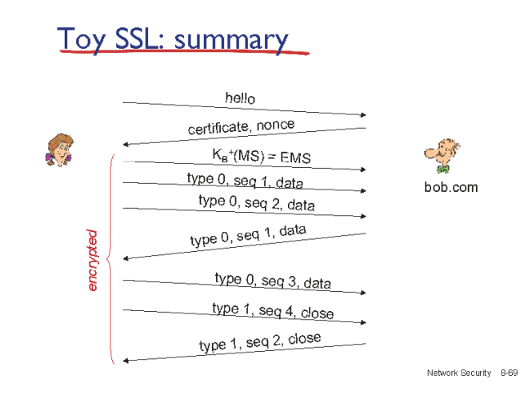
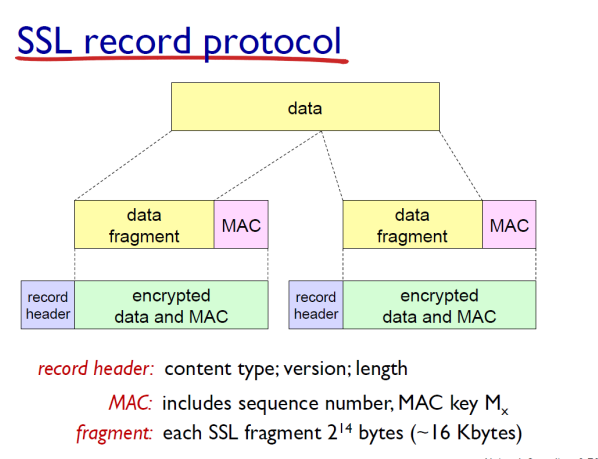
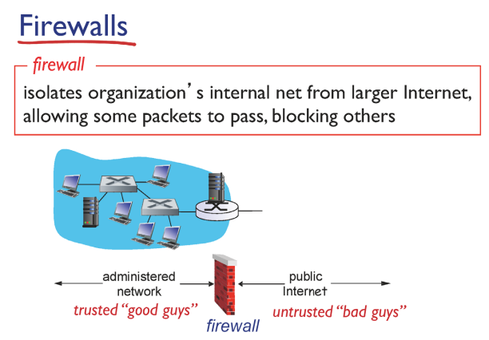
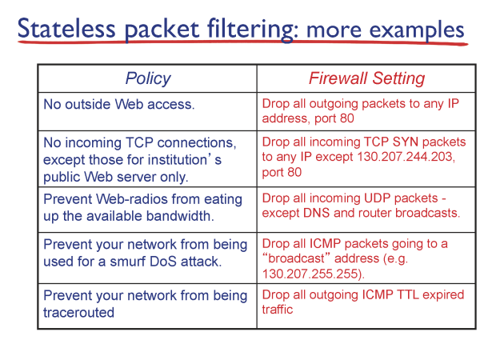

# Network Security: SSL and TCP/IP & Firewalls

## SSL and TCP/IP

✔ TCP는 보안 관련된 기능은 제공하지 않는다!  
✔ 추가적인 보안 장치 필요 -> **SSL**

### SSL

✔ SSL: Secure Socket Layer  
✔ TLS: Tranport Layer Security  
✔ SSL = TLS (별도의 layer는 아니다)

✔ plain text message가 SSL library를 거쳐 암호화 된 이후에 TCP로 내려간다.

### HTTPS

✔ HTTP + SSL  
✔ HTTP message를 SSL 통해 내려보내면 **HTTPS**가 된다.  

### 그림으로 나타낸 SSL 

✔ 메시지를 주고 받기 이전에 TCP connection이 연결되어야 한다.  
✔ server가 client한테 public key certificate을 전달해준다.  

### data records

✔ SSL의 전송단위는 record이다. (엄연히 말해서 새로운 layer는 아니다!)  
✔ MAC: Hash 값으로 암호화한 key 값  

✔ attacker가 record를 reordering 하는 것을 방지하기 위해 record의 sequence도 hash화 한다.  
✔ type을 통해 데이터 전송이 다 끝났는지(연결을 끊어도 되는지) 여부도 판별할 수 있다. (0: 아직 데이터 남음, 1: 데이터 전송 끝)

### SSL 연결 요약

## Firewalls

✔ gateway router에서 외부로 넘나드는 패킷을 monitoring 하는 device  
✔ 네트워크 운영자의 정책에 따라 패킷을 drop 시킨다.  

### Firewall 정책의 예시

